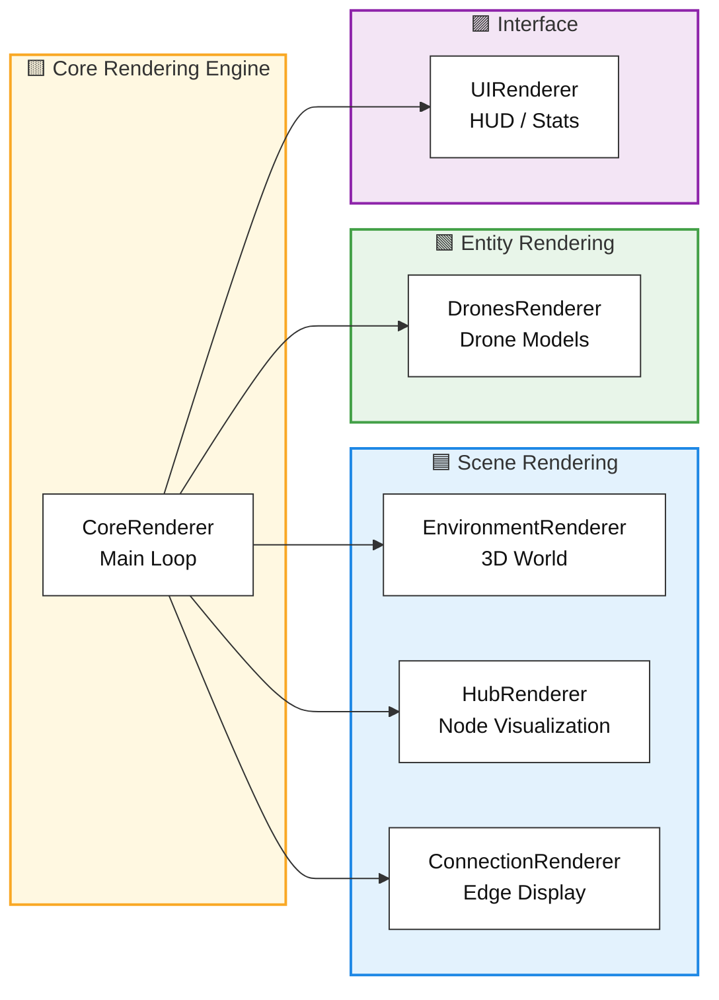

*This project has been created as part of the 42 curriculum by rpetit.*

# Fly In

## Description

**Fly In** is a sophisticated drone routing system that efficiently orchestrates multiple autonomous drones from a central base (start hub) to a target location (end hub) through a dynamically-constrained network of zones. The system minimizes simulation turns while respecting complex capacity constraints on both hubs and connections.

### Project Goal

Design and implement an intelligent pathfinding algorithm that:
- Routes multiple drones simultaneously through a graph-based network
- Respects zone capacity constraints (`max_drones` per hub)
- Respects connection capacity constraints (`max_link_capacity`)
- Handles multiple zone types with different movement costs
- Prevents conflicts, deadlocks, and capacity violations
- Provides real-time visual feedback of drone movements

### Key Features

- **Multi-Drone Coordination**: Simultaneous pathfinding for all drones with conflict resolution
- **Advanced Zone System**: Normal, Restricted (2-turn cost), Priority (preferred 1-turn), and Blocked zones
- **Capacity Management**: Constraints on maximum concurrent drones per zone and connection
- **3D Visualization**: Real-time 3D rendering of drone movements and network topology
- **Dinic's Algorithm Routing**: Max-flow over a time-expanded graph with full temporal awareness and capacity constraints
- **Type-Safe Implementation**: Full type hints with mypy strict compliance
- **Interactive CLI**: User-friendly command-line interface for map selection and configuration

### Preview
----

**Level Category Selection**: The application starts with an interactive map selector, allowing users to choose from various levels in `maps` directory (*the directory can be changed by adding `--maps-dir <path>`*).


----

**LeveL Map Selection**: After selecting a category, users can choose a specific level to solve, with metadata displayed for informed decision-making.


----

**3D Visualization**: The core rendering engine provides a dynamic view of the drone routing process, showing hubs, connections, and drone movements with clear visual indicators for zone types and capacities.


## Instructions

### Installation

#### Prerequisites
- Python 3.13 or later
- `uv` package manager (recommended) or `pip`

#### Setup

1. **Clone and navigate to project**
   ```bash
   git clone git@github.com:69Nesta/42-Fly-in.git
   cd fly-in
   ```

2. **Install dependencies**
   ```bash
   make install
   ```
   
   This installs:
   - `pydantic>=2.12.5` - Data validation and settings management
   - `questionary>=2.1.1` - Interactive CLI prompts
   - `raylib>=5.5.0.4` - 3D graphics rendering
   - `flake8>=7.3.0` - Code linting
   - `mypy>=1.20.0` - Static type checking

### Running the Application

#### Basic Execution
```bash
make run
# or
uv run -m src
```

This launches an interactive map selector to choose which level to solve (*by default the directory levels is `maps/` can be changed with `--maps-dir <path>`*).

#### Specify Input Map
```bash
make run ARGS="--input <path_to_map_file>"
# or
uv run -m src --input <path_to_map_file>
```

#### Verbose Logging
```bash
make run ARGS="--verbose"
# or
uv run -m src --verbose # or -v
```

#### Debug Mode
```bash
make debug
```

Launches the Python debugger for step-by-step execution.

#### Custom Output Path
```bash
make run ARGS="--output solution.txt"
```

#### Command-Line Options

```
--input, -i         Path to input map file
--maps_dir, -m      Directory containing maps (default: maps/)
--output, -o        Output file path (default: output.txt)
--verbose, -v       Enable verbose logging
```

### Available Make Targets

```bash
make install        # Install dependencies via uv sync
make run           # Execute the main application
make debug         # Run with Python debugger
make clean         # Remove __pycache__ and .mypy_cache
make fclean        # Full clean (removes .venv)
make lint          # Run flake8 + mypy with standard flags
make lint-strict   # Run mypy with strict mode enabled
```


## Algorithm Implementation

### Pathfinding Strategy: Dinic's Algorithm on a Time-Expanded Graph

The project implements **Dinic’s algorithm** for solving the multi-drone routing as a max-flow problem over a time-expanded graph. This approach turns the scheduling and capacity constraints into network flow constraints, guaranteeing no conflicts and optimal throughput for the given time horizon.

#### Algorithmic Approach

- **Time-expanded Graph**: Each state is `(Hub, Time)`, and the edges represent possible drone moves per timestep.
- **Max-flow with Dinic’s Algorithm**: 
  - Uses BFS to build level graphs (efficiently finds shortest augmenting paths in layered fashion).
  - Uses DFS to search for and augment along blocking flows at each BFS layer.
- **BFS**: Rapidly identifies all shortest layers from source to sink (start hub/time to end hub/time).
- **DFS**: Finds all possible augmenting paths within the level graph constructed by BFS.

#### Why Max-Flow/Dinic?
- Handles all drone movement, capacity, and scheduling constraints efficiently.
- Finds the maximum possible number of drones delivered to the goal for a given time, given all bottlenecks.
- Deadlocks and conflicts are encoded as flow bottlenecks.

#### Algorithm Steps:
1. **Initialization**: Create a time-expanded graph based on the current level state and reservations.
2. **BFS Layering**: Build level graph from source (start hub at time 0) to sink (end hub at any time).
3. **DFS Augmentation**: Search for augmenting paths in the level graph and update flows (reservations) accordingly.
4. **Repeat**: Continue BFS + DFS until no more augmenting paths exist, indicating maximum flow achieved for the current time horizon.
5. **Extract Paths**: Convert flow paths back into drone routes and apply flow as reservations for subsequent drones.

#### Time-expanded graph construction:
We start from this graph:


Then we expand it in time, creating a new layer for each time step:


### Time Complexity

- **Map Parsing**: O(H + C) where H = hubs, C = connections
- **Dinic**: normal dinic is O(V²E) but here we have to pass many drone so O(V²E+PN) where P is the number of drones and N is the number of nodes in the time-expanded graph

### Dinic Design Diagram
```mermaid

```
<p style="color: red;">
    Note: The solver design diagram is currently under development and will be added in the next iteration of the README.
</p>

## Architecture Overview # to rework
<p style="color: red;">
    Change to only have main: -> map_loader -> network -> dinic -> output -> renderer
</p>

```mermaid

```

## Visual Representation

### 3D Graphics Engine

The project provides a comprehensive 3D visualization using **PyRay** (Python bindings for Raylib), allowing real-time observation of drone movements:

#### Rendering Components



#### Features

**1. Hub Visualization**
- Nodes rendered as 3D Hub with color coding
- Zone types indicated through visual hierarchy:
  - **Start/End**: Distinctive shapes
  - **Priority**: Highlighted appearance
  - **Restricted**: Warning indicators
  - **Blocked**: Barricades or red coloring
- Zone capacity display via HUD overlay
- Name tags for identification

**2. Connection Display**
- Bidirectional edges rendered as 3D tubes
- Animated drone traversal along connections

**3. Drone Representation**
- Each drone rendered as a BB8 model
- Smooth interpolated movement between hubs
- State indicators via overlays (e.g., position, id, ...)
- If multiple drones occupy the same hub, name tags appear above to show the numbers and their ids

**4. Interactive Controls**
- **Mouse**: Rotate camera
- **WASD**: Move camera
- **Spacebar/Shift**: Ascend/Descend camera
- **Arrow Keys**: Step through simulation
- **Right Click**: To enable/disable cursor and interact with the map (hovering over hubs and connections will show their information in the HUD)
- **H**: Show/Hide help menu
- **O**: Show/Hide debug menu
- **ESC**: Quit

**5. HUD Information**
- Real-time simulation step counter
- Drones delivered / Total drones
- Frame rate (FPS)
- Zone/Connection hover information
- Capacity usage indicators
- Debug information (if enabled)

## Project Structure
<p style="color: red;">
    Note: The project structure diagram is currently under development and will be added in the next iteration of the README.
</p>

```
fly-in/
├── src/
│   ├── __main__.py                 # Application entry point
...
│   ├── render/
│   │   └── assets/                 # 3D assets
│   │       ├── models/             # Model files
│   │       └── skybox/             # Skybox textures
│   └── errors/                     # Custom exceptions
│       ├── FlyInError.py           # Base exception
│       ├── FileError.py            # File handling errors
│       └── ParseError.py           # Parsing errors
├── maps/                           # Test maps
│   ├── easy/                       # Easy difficulty levels
│   ├── medium/                     # Medium difficulty levels
│   ├── hard/                       # Hard difficulty levels
│   └── challenger/                 # Challenge levels
├── Makefile                        # Build and task automation
├── pyproject.toml                  # Project metadata and dependencies
└── README.md                       # This file
```

## Technical Choices

### 1. **Dinic's Algorithm on a Time-Expanded Graph**

**Why**: Classic single-agent pathfinding algorithms cannot model simultaneous multi-drone routing with shared capacity constraints. Casting the problem as a max-flow problem on a time-expanded graph solves this naturally:
- Each `(hub, time)` pair is a node; edges encode capacity constraints directly as flow limits.
- Dinic's BFS + DFS layering guarantees the maximum number of drones reach the goal within the time horizon.
- Deadlocks and bottlenecks are resolved implicitly by the flow algorithm rather than requiring explicit detection.
- Produces globally consistent routes rather than greedy per-drone plans.

**Trade-off**: Building the full time-expanded graph has higher upfront memory cost than single-agent search, but this is bounded by the simulation time horizon, which remains manageable for the target fleet sizes.

### 2. **Object-Oriented Architecture**

**Why**: The project mandates complete OOP implementation:
- **Hub, Connection, Drone**: Core domain objects with encapsulated behavior
- **Solver**: Orchestrates algorithm with clear responsibilities
- **Renderer Components**: Modular rendering pipeline
- Enables maintainability, extensibility, and type safety

### 3. **Type-Safe Python with Pydantic**

**Why**: Maximum reliability and IDE support:
- Pydantic models for data validation (`HubMetadata`, `Connection`)
- Full type hints with mypy strict compliance
- Runtime validation of map files
- Reduces bugs from type mismatches

### 4. **PyRay for 3D Visualization**

**Why**: Modern graphics rendering with Python bindings:
- Fast 3D graphics without C++ complexity
- Interactive camera controls
- Real-time performance monitoring
- Smooth drone animation and spatial understanding

### 5. **Sequential Greedy Assignment**

**Why**: Practical scheduling approach:
- Process drones one by one, each solved via a fresh Dinic pass on the residual graph
- Reservations guide subsequent drones away from congestion
- Reduces complexity while maintaining correctness
- Works well for maps with multiple diverse paths

## Resources

### References

- **Max-Flow and Graph Algorithms**
  - [Dinic's Algorithm](https://en.wikipedia.org/wiki/Dinic%27s_algorithm)
  - [Maximum Flow Problem](https://en.wikipedia.org/wiki/Maximum_flow_problem)
  - [Time-Expanded Graphs](https://en.wikipedia.org/wiki/Space%E2%80%93time_trade-off)
  - [Network Flow — Ford-Fulkerson Method](https://en.wikipedia.org/wiki/Ford%E2%80%93Fulkerson_algorithm)

- **Multi-Agent Pathfinding**
  - [Conflict-Based Search (CBS)](https://www.sciencedirect.com/science/article/pii/S0004370214001386)
  - [Capacity Constraints in Networks](https://en.wikipedia.org/wiki/Flow_network)

- **Type Safety in Python**
  - [Python Type Hints](https://docs.python.org/3/library/typing.html)
  - [Mypy Documentation](https://mypy.readthedocs.io/)
  - [Pydantic](https://docs.pydantic.dev/)

- **3D Graphics**
  - [Raylib Documentation](https://www.raylib.com/)
  - [PyRay (Python Raylib)](https://electronstudio.github.io/raylib-python-cffi/pyray.html)
  - [Bezier Curves](https://en.wikipedia.org/wiki/B%C3%A9zier_curve)

### AI Usage

This project utilized AI assistance for:

1. **README Skeleton & Documentation** (30%)
   - Initial structure and section organization
   - Content templates for algorithm explanation
   - Resource section layout
   - **Human refinement**: Customized algorithm explanation, architecture diagrams, technical choices

2. **Docstrings & Function Documentation** (40%)
   - PEP 257 compliant docstring generation
   - Parameter and return type documentation
   - Method purpose descriptions
   - **Human review**: Verified accuracy, added domain-specific details

3. **Dinic's Algorithm Questions** (30%)
   - Clarified time-expanded graph construction concepts
   - Max-flow formulation for multi-agent routing
   - Reservation system design patterns
   - **Human implementation**: Built complete algorithm with custom optimizations

**Key Principle**: All AI-generated content was reviewed, understood, tested, and integrated with substantial human modification. The implementation reflects deep understanding of the problem domain and constraint requirements.

## Testing Levels

The project includes test maps at various difficulty levels:

- **Easy**: Linear paths, simple routing
- **Medium**: Circular loops, dead ends, priority optimization
- **Hard**: Complex capacity constraints, maze-like topology
- **Challenger**: Ultimate performance test

*If you don't know how to launch the map selector or run the application, please refer to the Go to section "[Running the Application](#running-the-application)" section above.*


## Known Limitations

1. **Greedy Sequential Assignment**: Drones are planned one after another on the residual graph; this does not guarantee a globally optimal schedule on highly constrained maps
2. **No Rerouting**: Once a drone's path is committed into the flow, no re-augmentation occurs
3. **Static Graph**: Network topology cannot change during simulation
4. **Fixed Time Horizon**: The time-expanded graph is built up to a finite T; if the required horizon exceeds T, the solver will not find a solution
---

**Author**: Romeo Petit (rpetit)  
**School**: 42 School  
**Project**: Fly In (Autonomous Drone Routing System)  
**Version**: 2.0  
**Last Updated**: 2026
