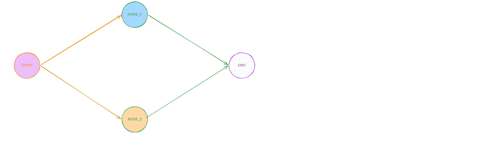
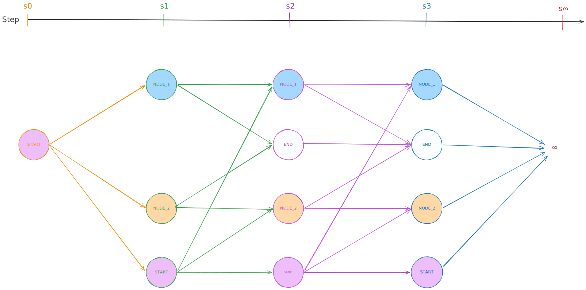
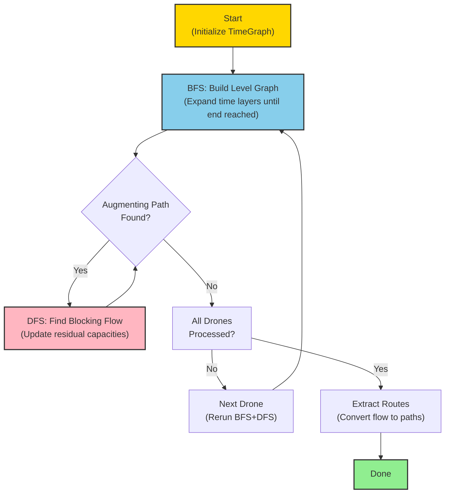
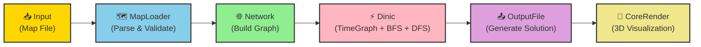
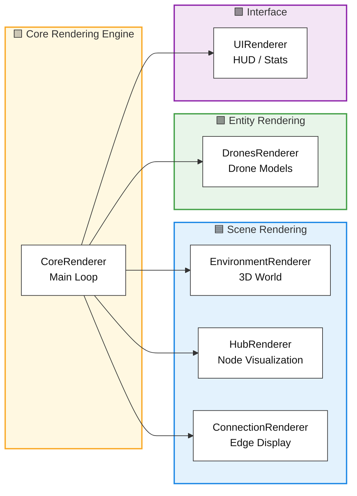

*This project has been created as part of the 42 curriculum by rpetit.*

# Fly In

## Description

**Fly In** is a sophisticated drone routing system that efficiently orchestrates multiple autonomous drones from a central base (start hub) to a target location (end hub) through a dynamically-constrained network of zones. The system minimizes simulation turns while respecting complex capacity constraints on both hubs and connections.

### Project Goal

Design and implement an intelligent pathfinding algorithm that:
- Routes multiple drones simultaneously through a graph-based network
- Respects zone capacity constraints (`max_drones` per hub)
- Respects connection capacity constraints (`max_link_capacity`)
- Handles multiple zone types with different movement costs
- Prevents conflicts, deadlocks, and capacity violations
- Provides real-time visual feedback of drone movements

### Key Features

- **Multi-Drone Coordination**: Simultaneous pathfinding for all drones with conflict resolution
- **Advanced Zone System**: Normal, Restricted (2-turn cost), Priority (preferred 1-turn), and Blocked zones
- **Capacity Management**: Constraints on maximum concurrent drones per zone and connection
- **3D Visualization**: Real-time 3D rendering of drone movements and network topology
- **Dinic's Algorithm Routing**: Max-flow over a time-expanded graph with full temporal awareness and capacity constraints
- **Type-Safe Implementation**: Full type hints with mypy strict compliance
- **Interactive CLI**: User-friendly command-line interface for map selection and configuration

### Preview
----

**Level Category Selection**: The application starts with an interactive map selector, allowing users to choose from various levels in `maps` directory (*the directory can be changed by adding `--maps-dir <path>`*).


----

**LeveL Map Selection**: After selecting a category, users can choose a specific level to solve, with metadata displayed for informed decision-making.


----

**3D Visualization**: The core rendering engine provides a dynamic view of the drone routing process, showing hubs, connections, and drone movements with clear visual indicators for zone types and capacities.


## Instructions

### Installation

#### Prerequisites
- Python 3.13 or later
- `uv` package manager

#### Setup

1. **Clone and navigate to project**
   ```bash
   git clone git@github.com:69Nesta/42-Fly-in.git
   cd fly-in
   ```

2. **Install dependencies**
   ```bash
   make install
   ```

   This installs:
   - `pydantic>=2.12.5` - Data validation and settings management
   - `questionary>=2.1.1` - Interactive CLI prompts
   - `raylib>=5.5.0.4` - 3D graphics rendering
   - `flake8>=7.3.0` - Code linting
   - `mypy>=1.20.0` - Static type checking

### Running the Application

#### Basic Execution
```bash
make run
# or
uv run -m src
```

This launches an interactive map selector to choose which level to solve (*by default the directory levels is `maps/` can be changed with `--maps-dir <path>`*).

#### Specify Input Map
```bash
make run ARGS="--input <path_to_map_file>"
# or
uv run -m src --input <path_to_map_file>
```

#### Verbose Logging
```bash
make run ARGS="--verbose"
# or
uv run -m src --verbose
```

#### Debug Mode
```bash
make debug
```

Launches the Python debugger for step-by-step execution.

#### Custom Output Path
```bash
make run ARGS="--output solution.txt"
# or
uv run -m src --output solution.txt
```

#### Command-Line Options

```
--input, -i         Path to input map file
--maps_dir, -m      Directory containing maps (default: maps/)
--output, -o        Output file path (default: output.txt)
--verbose, -v       Enable verbose logging
```

### Available Make Targets

```bash
make install        # Install dependencies via uv sync
make run           # Execute the main application
make debug         # Run with Python debugger
make clean         # Remove __pycache__ and .mypy_cache
make fclean        # Full clean (removes .venv)
make lint          # Run flake8 + mypy with standard flags
make lint-strict   # Run mypy with strict mode enabled
```


## Algorithm Implementation

### Overview: Max-Flow on a Time-Expanded Graph

**Fly In** solves the multi-drone routing problem by reducing it to a **maximum flow** problem. Instead of planning drones greedily one at a time with local decision-making, the solver models the entire problem as a flow network where:
- Each `(hub, time)` pair is a node in the graph
- Edges between nodes represent valid moves (stay or traverse a connection)
- Edge capacities encode constraints (max drones per hub, max capacity per connection)
- Flow units represent individual drones moving through the network

This formulation guarantees **no conflicts, deadlocks, or capacity violations** while finding the optimal routing for all drones.

### Problem Formulation

Given:
- A network of hubs H and connections C
- P drones starting at source hub at time 0
- Capacity constraints: `max_drones` per hub, `max_capacity` per connection
- Zone types with different traversal costs (Normal: 1, Priority: 1, Restricted: 2, Blocked: ∞)
- Goal: Deliver all drones to the end hub in minimum time

**Solution Approach**: Find maximum flow from `(source, time=0)` to `(sink, any_time)` in a time-expanded network, where each unit of flow represents a drone taking one complete route.

### Time-Expanded Graph Construction

The time-expanded graph transforms a static network into a temporal dimension:

#### Step 1: Base Network

We start with the original network:



Each hub is a node; each connection is an edge with associated capacity.

#### Step 2: Temporal Expansion

For each time step `t` from 0 to T (time horizon):
- Create a copy of each hub at time t: `(hub_i, t)`
- Add transition edges:
  - **Stay edges**: `(hub_i, t) → (hub_i, t+1)` with infinite capacity (drones can wait)
  - **Movement edges**: `(hub_i, t) → (hub_j, t+cost)` for each connection with traversal cost



#### Step 3: Capacity Modeling

Edge capacities encode problem constraints:
- Hub nodes: Split into `in_node` and `out_node` with capacity equal to `max_drones` (bottleneck constraint)
- Connection edges: Capacity equals `max_link_capacity` (shared bandwidth across all time steps)
- Zone restrictions: Traversal cost or capacity reflects zone type (Blocked = 0 capacity, Restricted = 2 time steps, etc.)

### Dinic's Algorithm: BFS + DFS Framework

Dinic's algorithm efficiently computes maximum flow through two phases per iteration:

#### Phase 1: BFS Level Graph Construction

- **Goal**: Build a "level graph" showing all shortest paths from source to sink
- **Process**: 
  - Start BFS from `(source, t=0)`
  - Assign level = distance for each reachable node
  - Stop when sink is reached or no more augmenting paths exist
- **Complexity**: O(V·E) per BFS pass
- **Benefit**: Identifies optimal layers for flow augmentation

#### Phase 2: DFS Blocking Flow Search

- **Goal**: Find all augmenting paths within the level graph and saturate them
- **Process**:
  - Use DFS to find paths from source to sink using only forward edges in level graph
  - For each path found, determine bottleneck capacity
  - Augment flow by bottleneck amount (mark edges as saturated if full)
  - Continue until no more augmenting paths exist in this level graph
- **Complexity**: O(V²·E) for full blocking flow
- **Benefit**: Multiple paths found per DFS iteration, more efficient than Ford-Fulkerson

#### Combined Complexity

- Standard Dinic: O(V²·E) for maximum flow
- **Our variant**: O(V²·E + P·N) where:
  - P = number of drones
  - N = nodes in time-expanded graph
  - We repeat BFS+DFS sequentially for each drone on residual graph

### Sequential Drone Processing (Greedy Assignment)

Rather than solving for all drones simultaneously (which would create a single massive flow value), drones are routed one-by-one:

1. **Drone 1**: Solve max-flow (typically finds 1 unit of flow = 1 path)
2. **Extract Path**: Convert flow unit to a concrete route
3. **Reserve**: Mark all edges used as partially consumed (residual capacities reduced)
4. **Drone 2+**: Repeat on residual graph with updated capacities

**Why this works**:
- Greedy assignment naturally spreads drones across diverse paths
- Reservations guide later drones away from congested routes
- Each drone sees a fresh BFS-constructed level graph, avoiding local deadlocks
- Simpler than globally optimizing all P drones at once

**Trade-off**: Not globally optimal on extremely constrained maps, but sufficient for well-designed levels.

### Algorithm Execution Steps

1. **Initialization**
   - Parse map and create Network object
   - Initialize TimeGraph with infinite time horizon
   - Set initial capacities on all edges

2. **For each drone (1 to P)**
   - Run BFS to build level graph from source to sink
   - Run DFS to find all blocking flows in level graph
   - Extract one drone path from the flow
   - Update residual capacities (reduce edge capacities)
   - Log drone path and statistics

3. **Output**
   - Compute simulation length (max time reached by any drone)
   - Generate solution file with all drone paths
   - Prepare visualization state

4. **Rendering**
   - Display 3D network with computed drone paths
   - Allow interactive step-through of simulation

### Time Complexity Analysis

| Component | Complexity | Notes |
|-----------|-----------|-------|
| **Map Parsing** | O(H + C) | H hubs, C connections |
| **Network Init** | O(H + C) | Build graph structure |
| **TimeGraph Build** | O(T·N) | T time steps, N base nodes; expanded to T·N nodes |
| **Single BFS** | O(V·E) | V = T·N, E = expanded edges |
| **Single DFS** | O(V²·E) | Dinic blocking flow within one level graph |
| **Per Drone** | O(V²·E) | One BFS + DFS iteration |
| **Total (P drones)** | O(P·V²·E) | Sequential processing of all drones |

**Practical**: Most maps solve in seconds; bottleneck is usually the Restricted zone cost doubling time steps.

### Dinic Algorithm Flow



## Performance Benchmarks
| Map | Map Path | Target Turns | Your Solution |
| --- | --- | --- | --- |
| Linear path (2 drones)                     | maps/easy/01_linear_path_2_drones.txt                 | ≤6  | 4  |
| Simple fork (4 drones)                     | maps/easy/02_simple_fork_4_drones.txt                 | ≤8  | 4  |
| Basic capacity (4 drones)                  | maps/easy/03_basic_capacity_4_drones.txt              | ≤6  | 4  |
| Dead end trap (5 drones)                   | maps/medium/01_dead_end_trap_5_drones.txt             | ≤12 | 8  |
| Circular loop (6 drones)                   | maps/medium/02_circular_loop_6_drones.txt             | ≤15 | 10 |
| Priority puzzle (5 drones)                 | maps/medium/03_priority_puzzle_5_drones.txt           | ≤12 | 6  |
| Maze nightmare (8 drones)                  | maps/hard/01_maze_nightmare_8_drones.txt              | ≤30 | 13 |
| Capacity hell (12 drones)                  | maps/hard/02_capacity_hell_12_drones.txt              | ≤35 | 16 |
| Ultimate challenge (15 drones)             | maps/hard/03_ultimate_challenge_15_drones.txt         | ≤45 | 26 |
| The Impossible Dream (25 drones, optional) | maps/challenger/01_the_impossible_dream_25_drones.txt | ≤45 | 43 |

## Architecture Overview

The application follows a streamlined pipeline for solving the drone routing problem:



### Core Components

**1. MapLoader**: Parses and validates the input map file, creating node and connection definitions with metadata.

**2. Network**: Constructs the graph representation, initializes drones, and maintains state throughout solving.

**3. Dinic (Main Algorithm)**:
- **TimeGraph**: Expands the network into a time-layered graph where each `(node, time)` is a state
- **BFS**: Builds level graphs, finding shortest paths from start to end in the time-expanded network
- **DFS**: Computes blocking flows by finding augmenting paths within level graphs
- Together they implement Dinic's max-flow algorithm to optimally route all drones

**4. OutputFile**: Writes the computed drone paths to the solution file.

**5. CoreRender**: Provides 3D visualization and interactive simulation replay.

## Visual Representation

### 3D Graphics Engine

The project provides a comprehensive 3D visualization using **PyRay** (Python bindings for Raylib), allowing real-time observation of drone movements:

#### Rendering Components



#### Features

**1. Hub Visualization**
- Nodes rendered as 3D Hub with color coding
- Zone types indicated through visual hierarchy:
  - **Start/End**: Distinctive shapes
  - **Priority**: Highlighted appearance
  - **Restricted**: Warning indicators
  - **Blocked**: Barricades or red coloring
- Zone capacity display via HUD overlay
- Name tags for identification

**2. Connection Display**
- Bidirectional edges rendered as 3D tubes
- Animated drone traversal along connections

**3. Drone Representation**
- Each drone rendered as a BB8 model
- Smooth interpolated movement between hubs
- State indicators via overlays (e.g., position, id, ...)
- If multiple drones occupy the same hub, name tags appear above to show the numbers and their ids

**4. Interactive Controls**
- **Mouse**: Rotate camera
- **WASD**: Move camera
- **Spacebar/Shift**: Ascend/Descend camera
- **Arrow Keys**: Step through simulation
- **Right Click**: To enable/disable cursor and interact with the map (hovering over hubs and connections will show their information in the HUD)
- **H**: Show/Hide help menu
- **O**: Show/Hide debug menu
- **ESC**: Quit

**5. HUD Information**
- Real-time simulation step counter
- Drones delivered / Total drones
- Frame rate (FPS)
- Zone/Connection hover information
- Capacity usage indicators
- Debug information (if enabled)

## Project Structure

```
fly-in/
├── src/
│   ├── __main__.py                 # Application entry point
│   ├── __init__.py
│   ├── args_parser.py              # Command-line argument parsing
│   ├── map_loader.py               # Map file parsing and validation
│   ├── map_selector.py             # Interactive map selection UI
│   ├── output_file.py              # Solution file generation
│   ├── algo/                       # Dinic's Algorithm Implementation
│   │   ├── dinic.py                # Main Dinic solver orchestrator
│   │   ├── bfs/                    # BFS level graph construction
│   │   │   ├── bfs.py
│   │   │   ├── bfs_node.py
│   │   │   ├── bfs_edge.py
│   │   │   └── bfs_object.py
│   │   ├── dfs/                    # DFS augmenting path search
│   │   │   └── dfs.py
│   │   └── time_graph/             # Time-expanded graph representation
│   │       ├── time_graph.py
│   │       ├── node.py
│   │       ├── graph_node.py
│   │       └── connection_node.py
│   ├── network/                    # Network & Graph Data Structures
│   │   ├── network.py              # Main network container
│   │   ├── network_object.py
│   │   ├── node/                   # Hub nodes
│   │   │   ├── node.py
│   │   │   └── node_type.py
│   │   ├── connection/             # Network connections/edges
│   │   │   ├── connection.py
│   │   │   └── connection_manager.py
│   │   ├── drone/                  # Drone entities
│   │   │   └── drone.py
│   │   └── metadata/               # Node & connection metadata
│   │       ├── node_metadata.py
│   │       ├── connection_metadata.py
│   │       └── color_metadata.py
│   ├── render/                     # 3D Visualization & Rendering
│   │   ├── core_render.py          # Main rendering loop
│   │   ├── environment.py
│   │   ├── renderer/               # Specialized renderers
│   │   │   ├── nodes_renderer.py
│   │   │   ├── drones_renderer.py
│   │   │   ├── connection_renderer.py
│   │   │   ├── environment_renderer.py
│   │   │   └── ui_renderer.py
│   │   ├── models/                 # 3D model definitions
│   │   │   ├── node_model.py
│   │   │   ├── drone_model.py
│   │   │   ├── connection_model.py
│   │   │   └── collision_model.py
│   │   ├── components/             # UI components
│   │   │   ├── name_tag.py
│   │   │   └── text_box.py
│   │   ├── controller/             # Input handling
│   │   │   └── input_controller.py
│   │   ├── utils/                  # Rendering utilities
│   │   │   ├── color_map.py
│   │   │   └── ray_cast.py
│   │   └── assets/                 # 3D assets
│   │       ├── models/             # Model files
│   │       └── skybox/             # Skybox textures
│   ├── utils/                      # Utility functions
│   │   ├── logger.py               # Logging system
│   │   ├── color.py                # Color utilities
│   │   ├── math_utils.py           # Mathematical helpers
│   │   ├── bezier.py               # Bezier curve interpolation
│   │   └── str_utils.py            # String utilities
│   └── errors/                     # Custom exceptions
│       ├── FlyInError.py           # Base exception
│       ├── FileError.py            # File handling errors
│       └── ParseError.py           # Parsing errors
├── tests                           # Unit and integration tests
│   ├── __init__.py
│   ├── __main__.py                 # Test suite entry point
│   └── test_all_map.py             # Test suite for all maps
├── maps/                           # Test maps
│   ├── easy/                       # Easy difficulty levels
│   ├── medium/                     # Medium difficulty levels
│   ├── hard/                       # Hard difficulty levels
│   └── challenger/                 # Challenge levels (optional)
├── assets/                         # Project assets
│   ├── preview/                    # README screenshots
│   └── dinic/                      # Algorithm diagrams
├── Makefile                        # Build and task automation
├── pyproject.toml                  # Project metadata and dependencies
└── README.md                       # This file
```

## Technical Choices

### 1. **Dinic's Algorithm on a Time-Expanded Graph**

**Why**: Classic single-agent pathfinding algorithms cannot model simultaneous multi-drone routing with shared capacity constraints. Casting the problem as a max-flow problem on a time-expanded graph solves this naturally:
- Each `(hub, time)` pair is a node; edges encode capacity constraints directly as flow limits.
- Dinic's BFS + DFS layering guarantees the maximum number of drones reach the goal within the time horizon.
- Deadlocks and bottlenecks are resolved implicitly by the flow algorithm rather than requiring explicit detection.
- Produces globally consistent routes rather than greedy per-drone plans.

**Trade-off**: Building the full time-expanded graph has higher upfront memory cost than single-agent search, but this is bounded by the simulation time horizon, which remains manageable for the target fleet sizes.

### 2. **Object-Oriented Architecture**

**Why**: The project mandates complete OOP implementation:
- **Hub, Connection, Drone**: Core domain objects with encapsulated behavior
- **Solver**: Orchestrates algorithm with clear responsibilities
- **Renderer Components**: Modular rendering pipeline
- Enables maintainability, extensibility, and type safety

### 3. **Type-Safe Python with Pydantic**

**Why**: Maximum reliability and IDE support:
- Pydantic models for data validation (`HubMetadata`, `Connection`)
- Full type hints with mypy strict compliance
- Runtime validation of map files
- Reduces bugs from type mismatches

### 4. **PyRay for 3D Visualization**

**Why**: Modern graphics rendering with Python bindings:
- Fast 3D graphics without C++ complexity
- Interactive camera controls
- Real-time performance monitoring
- Smooth drone animation and spatial understanding

### 5. **Sequential Greedy Assignment**

**Why**: Practical scheduling approach:
- Process drones one by one, each solved via a fresh Dinic pass on the residual graph
- Reservations guide subsequent drones away from congestion
- Reduces complexity while maintaining correctness
- Works well for maps with multiple diverse paths

## Resources

### References

- **Max-Flow and Graph Algorithms**
  - [Dinic's Algorithm](https://en.wikipedia.org/wiki/Dinic%27s_algorithm)
  - [Maximum Flow Problem](https://en.wikipedia.org/wiki/Maximum_flow_problem)
  - [Time-Expanded Graphs](https://en.wikipedia.org/wiki/Space%E2%80%93time_trade-off)
  - [Network Flow — Ford-Fulkerson Method](https://en.wikipedia.org/wiki/Ford%E2%80%93Fulkerson_algorithm)

- **Multi-Agent Pathfinding**
  - [Conflict-Based Search (CBS)](https://www.sciencedirect.com/science/article/pii/S0004370214001386)
  - [Capacity Constraints in Networks](https://en.wikipedia.org/wiki/Flow_network)

- **Type Safety in Python**
  - [Python Type Hints](https://docs.python.org/3/library/typing.html)
  - [Mypy Documentation](https://mypy.readthedocs.io/)
  - [Pydantic](https://docs.pydantic.dev/)

- **3D Graphics**
  - [Raylib Documentation](https://www.raylib.com/)
  - [PyRay (Python Raylib)](https://electronstudio.github.io/raylib-python-cffi/pyray.html)
  - [Bezier Curves](https://en.wikipedia.org/wiki/B%C3%A9zier_curve)

### AI Usage

This project utilized AI assistance for:

1. **README Skeleton & Documentation** (30%)
   - Initial structure and section organization
   - Content templates for algorithm explanation
   - Resource section layout
   - **Human refinement**: Customized algorithm explanation, architecture diagrams, technical choices

2. **Docstrings & Function Documentation** (40%)
   - PEP 257 compliant docstring generation
   - Parameter and return type documentation
   - Method purpose descriptions
   - **Human review**: Verified accuracy, added domain-specific details

3. **Dinic's Algorithm Questions** (30%)
   - Clarified time-expanded graph construction concepts
   - Max-flow formulation for multi-agent routing
   - Reservation system design patterns
   - **Human implementation**: Built complete algorithm with custom optimizations

**Key Principle**: All AI-generated content was reviewed, understood, tested, and integrated with substantial human modification. The implementation reflects deep understanding of the problem domain and constraint requirements.

## Testing Levels

The project includes test maps at various difficulty levels:

- **Easy**: Linear paths, simple routing
- **Medium**: Circular loops, dead ends, priority optimization
- **Hard**: Complex capacity constraints, maze-like topology
- **Challenger**: Ultimate performance test

*If you don't know how to launch the map selector or run the application, please refer to the Go to section "[Running the Application](#running-the-application)" section above.*


## Known Limitations

- **Memory usage**: The time-expanded graph grows linearly with the time horizon and number of hubs; very large horizons or high drone counts can produce high memory usage.
- **Rendering dependencies**: The 3D visualization relies on PyRay and a working graphics driver; in headless or resource-constrained environments (or when simulating extremely large numbers of drones — e.g. >10k), rendering may be slow or unstable.

---

**Author**: Romeo Petit (rpetit)  
**School**: 42 School  
**Project**: Fly In (Autonomous Drone Routing System)  
**Version**: 2.0  
**Last Updated**: 2026
