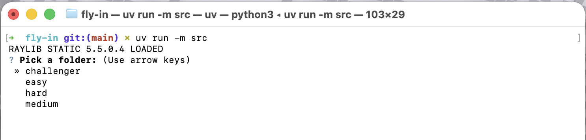
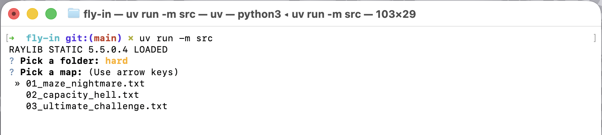
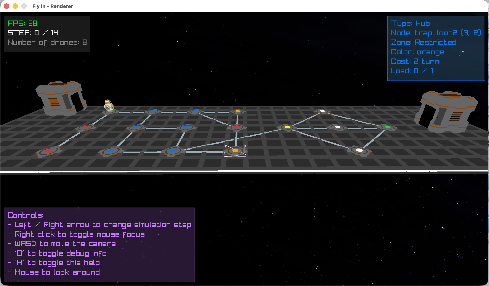
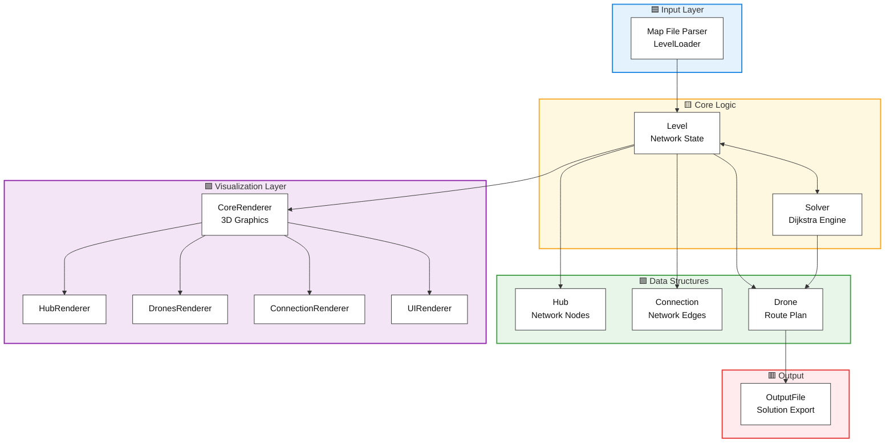
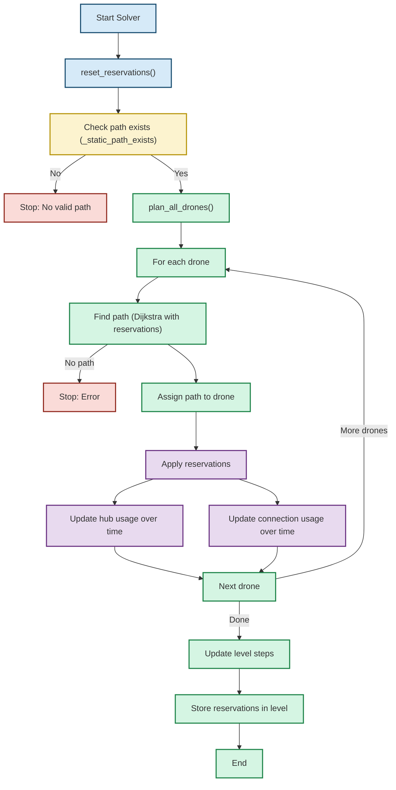
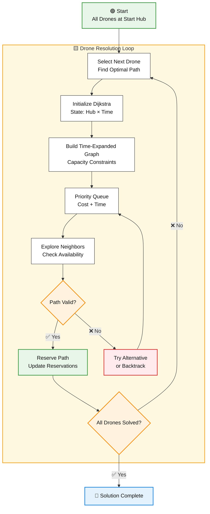
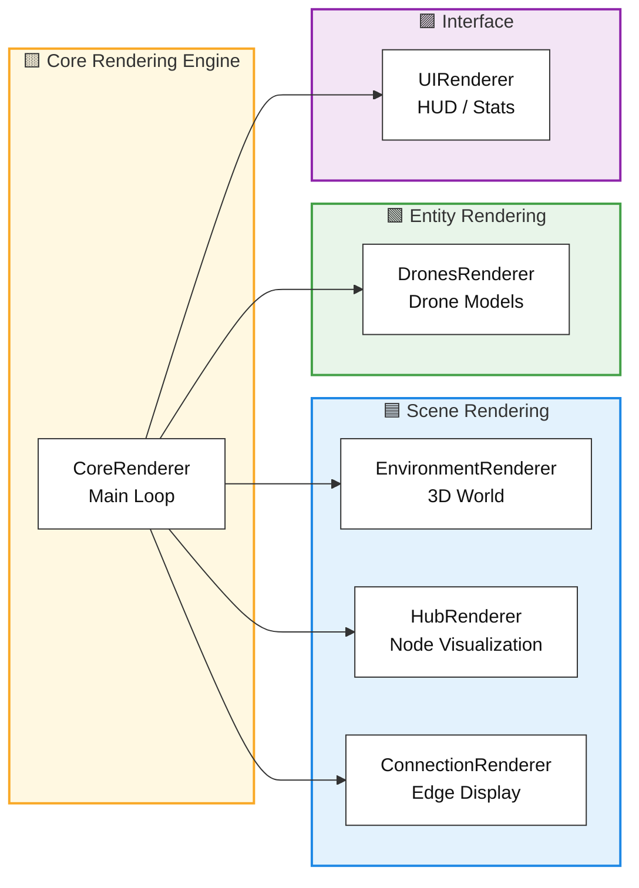

*This project has been created as part of the 42 curriculum by rpetit.*

# Fly In

## Description

**Fly In** is a sophisticated drone routing system that efficiently orchestrates multiple autonomous drones from a central base (start hub) to a target location (end hub) through a dynamically-constrained network of zones. The system minimizes simulation turns while respecting complex capacity constraints on both hubs and connections.

### Project Goal

Design and implement an intelligent pathfinding algorithm that:
- Routes multiple drones simultaneously through a graph-based network
- Respects zone capacity constraints (`max_drones` per hub)
- Respects connection capacity constraints (`max_link_capacity`)
- Handles multiple zone types with different movement costs
- Prevents conflicts, deadlocks, and capacity violations
- Provides real-time visual feedback of drone movements

### Key Features

- **Multi-Drone Coordination**: Simultaneous pathfinding for all drones with conflict resolution
- **Advanced Zone System**: Normal, Restricted (2-turn cost), Priority (preferred 1-turn), and Blocked zones
- **Capacity Management**: Constraints on maximum concurrent drones per zone and connection
- **3D Visualization**: Real-time 3D rendering of drone movements and network topology
- **Dijkstra-Based Routing**: Optimized shortest-path algorithm with temporal awareness and reservations
- **Type-Safe Implementation**: Full type hints with mypy strict compliance
- **Interactive CLI**: User-friendly command-line interface for map selection and configuration

### Preview
----

**Level Category Selection**: The application starts with an interactive map selector, allowing users to choose from various levels in `maps` directory (*the directory can be changed by adding `--maps-dir <path>`*).


----

**LeveL Map Selection**: After selecting a category, users can choose a specific level to solve, with metadata displayed for informed decision-making.


----

**3D Visualization**: The core rendering engine provides a dynamic view of the drone routing process, showing hubs, connections, and drone movements with clear visual indicators for zone types and capacities.


## Architecture Overview



## Solver Design


## Algorithm Implementation

### Pathfinding Strategy: Dijkstra with Temporal Reservations

The project implements a **modified Dijkstra's algorithm** that considers both spatial and temporal constraints:

#### Core Concept

Traditional Dijkstra finds shortest paths in static graphs. Fly In extends this by:
1. **Temporal State Space**: Each hub is represented as `(Hub, Time)` pairs, creating a time-expanded graph
2. **Dynamic Reservations**: Track when drones occupy each hub and connection
3. **Greedy Scheduling**: Process drones sequentially, reserving paths to guide future drones away from congestion

#### Algorithm Flow



#### Key Components

**1. State Representation**
```
State = (hub, current_time)
Cost = base_path_cost + time_penalty
```

**2. Hub Availability**
- A hub at time `t` is available if: `reservations[hub][t] < hub.max_drones`
- For `start` and `end` hubs: unlimited capacity
- For normal hubs: default max_drones = 1

**3. Connection Availability**
- A connection at time `t` is available if: `reservations_connection[conn][t] < conn.max_link_capacity`
- Connections are bidirectional
- Multi-turn traversals (restricted zones) block the connection during transit

**4. Zone Type Costs**
| Zone Type | Movement Cost | Behavior |
|-----------|---------------|----------|
| **normal** | 1 turn | Default traversal |
| **restricted** | 2 turns | Occupies connection for 2 turns; must reach destination |
| **priority** | 1 turn | Preferred path; lower cost prioritizes these routes |
| **blocked** | ∞ | Inaccessible; cannot enter |

#### Reservation System

The solver maintains two reservation maps:

```python
reservations[hub][time] = drone_count
reservations_connection[connection][time] = drone_count
```

This enables:
- **Conflict Detection**: Identify capacity violations before assigning paths
- **Path Guidance**: Influence pathfinding toward uncongested routes
- **Deadlock Avoidance**: Prevent circular dependencies through sequential planning

### Time Complexity

- **Per Drone**: O((V + E) × log(V × T)) where T = simulation time
- **Total**: O(D × (V + E) × log(V × T)) for D drones
- Practical optimization: Time horizon limited by greedy sequential assignment

## Input Format

Map files define the drone routing problem with the following syntax:

```
nb_drones: <number>

start_hub: <name> <x> <y> [metadata]
end_hub: <name> <x> <y> [metadata]
hub: <name> <x> <y> [metadata]

connection: <hub1>-<hub2> [metadata]
```

### Hub Metadata

```
[zone=<type> color=<name> max_drones=<int>]
```

- **zone**: `normal` (default), `restricted`, `priority`, `blocked`
- **color**: Any single-word string for visual identification
- **max_drones**: Maximum concurrent drones (default: 1)

### Connection Metadata

```
[max_link_capacity=<int>]
```

- **max_link_capacity**: Maximum concurrent drones on connection (default: 1)

### Example

```
nb_drones: 3
start_hub: hub 0 0 [color=green]
end_hub: goal 10 10 [color=yellow]
hub: roof1 3 4 [zone=priority color=blue max_drones=2]
hub: restricted_zone 5 5 [zone=restricted color=red]
connection: hub-roof1 [max_link_capacity=2]
connection: roof1-restricted_zone
connection: restricted_zone-goal
```

## Instructions

### Installation

#### Prerequisites
- Python 3.13 or later
- `uv` package manager (recommended) or `pip`

#### Setup

1. **Clone and navigate to project**
   ```bash
   git clone git@github.com:69Nesta/42-Fly-in.git
   cd fly-in
   ```

2. **Install dependencies**
   ```bash
   make install
   ```
   
   This installs:
   - `pydantic>=2.12.5` - Data validation and settings management
   - `questionary>=2.1.1` - Interactive CLI prompts
   - `raylib>=5.5.0.4` - 3D graphics rendering
   - `flake8>=7.3.0` - Code linting
   - `mypy>=1.20.0` - Static type checking

### Running the Application

#### Basic Execution
```bash
make run
```

This launches an interactive map selector to choose which level to solve (*by default the directory levels is `maps/` can be changed with `--maps-dir <path>`*).

#### Specify Input Map
```bash
make run ARGS="--input maps/easy/01_linear_path.txt"
```

#### Verbose Logging
```bash
make run ARGS="--verbose"
```

#### Debug Mode
```bash
make debug
```

Launches the Python debugger for step-by-step execution.

#### Custom Output Path
```bash
make run ARGS="--output solution.txt"
```

### Available Make Targets

```bash
make install        # Install dependencies via uv sync
make run           # Execute the main application
make debug         # Run with Python debugger
make clean         # Remove __pycache__ and .mypy_cache
make fclean        # Full clean (removes .venv)
make lint          # Run flake8 + mypy with standard flags
make lint-strict   # Run mypy with strict mode enabled
```

### Command-Line Options

```
--input, -i         Path to input map file
--maps_dir, -m      Directory containing maps (default: maps/)
--output, -o        Output file path (default: output.txt)
--verbose, -v       Enable verbose logging
```

## Visual Representation

### 3D Graphics Engine

The project provides a comprehensive 3D visualization using **PyRay** (Python bindings for Raylib), allowing real-time observation of drone movements:

#### Rendering Components



#### Features

**1. Hub Visualization**
- Nodes rendered as 3D Hub with color coding
- Zone types indicated through visual hierarchy:
  - **Start/End**: Distinctive shapes
  - **Priority**: Highlighted appearance
  - **Restricted**: Warning indicators
  - **Blocked**: Barricades or red coloring
- Zone capacity display via HUD overlay
- Name tags for identification

**2. Connection Display**
- Bidirectional edges rendered as 3D tubes
- Animated drone traversal along connections

**3. Drone Representation**
- Each drone rendered as a BB8 model
- Smooth interpolated movement between hubs
- State indicators via overlays (e.g., position, id, ...)
- If multiple drones occupy the same hub, name tags appear above to show the numbers and their ids

**4. Interactive Controls**
- **Mouse**: Rotate camera
- **WASD**: Move camera
- **Spacebar/Shift**: Ascend/Descend camera
- **Arrow Keys**: Step through simulation
- **Right Click**: To enable/disable cursor and interact with the map (hovering over hubs and connections will show their information in the HUD)
- **H**: Show/Hide help menu
- **O**: Show/Hide debug menu
- **ESC**: Quit

**5. HUD Information**
- Real-time simulation step counter
- Drones delivered / Total drones
- Frame rate (FPS)
- Zone/Connection hover information
- Capacity usage indicators
- Debug information (if enabled)

## Project Structure

```
fly-in/
├── src/
│   ├── __main__.py                 # Application entry point
│   ├── Solver.py                   # Dijkstra pathfinding engine
│   ├── Level.py                    # Network state management
│   ├── Drone.py                    # Drone representation
│   ├── Hub.py                      # Hub/zone representation
│   ├── Connections.py              # Connection/edge management
│   ├── LevelLoader.py              # Map file parser
│   ├── OutputFile.py               # Solution exporter
│   ├── ArgsParser.py               # CLI argument parsing
│   ├── MapSelector.py              # Interactive map selection
│   ├── Enums.py                    # Type enumerations
│   ├── utils/                      # Utility modules
│   │   ├── Logger.py               # Logging with colors
│   │   ├── Color.py                # Color definitions
│   │   ├── MathUtils.py            # Mathematical utilities
│   │   ├── Bezier.py               # Bezier curve calculations
│   │   └── StrUtils.py             # String utilities
│   ├── renderer/                   # 3D visualization system
│   │   ├── CoreRenderer.py         # Main render engine
│   │   ├── HubRenderer.py          # Hub rendering
│   │   ├── DronesRenderer.py       # Drone rendering
│   │   ├── ConnectionRenderer.py   # Connection rendering
│   │   ├── UIRenderer.py           # HUD/UI overlay
│   │   ├── EnvironmentRenderer.py  # 3D environment
│   │   ├── InputController.py      # Camera/input control
│   │   ├── RayCast.py              # Ray intersection detection
│   │   ├── SkyBox.py               # Skybox rendering
│   │   ├── ColorMap.py             # Color management
│   │   ├── components/             # UI components
│   │   │   ├── NameTag.py          # 3D text labels
│   │   │   └── TextBox.py          # UI text elements
│   │   ├── models/                 # 3D model management
│   │   │   ├── HubModel.py         # Hub geometry
│   │   │   ├── DroneModel.py       # Drone geometry
│   │   │   ├── ConnectionModel.py  # Connection geometry
│   │   │   ├── EnvironmentModel.py # World geometry
│   │   │   ├── PlatformModel.py    # Platform geometry
│   │   │   ├── CollisionModel.py   # Collision primitives
│   │   │   └── SDModel.py          # Signed distance modeling
│   │   └── assets/                 # 3D assets
│   │       ├── models/             # Model files
│   │       └── skybox/             # Skybox textures
│   └── errors/                     # Custom exceptions
│       ├── FlyInError.py           # Base exception
│       ├── FileError.py            # File handling errors
│       └── ParseError.py           # Parsing errors
├── maps/                           # Test maps
│   ├── easy/                       # Easy difficulty levels
│   ├── medium/                     # Medium difficulty levels
│   ├── hard/                       # Hard difficulty levels
│   └── challenger/                 # Challenge levels
├── Makefile                        # Build and task automation
├── pyproject.toml                  # Project metadata and dependencies
└── README.md                       # This file
```

## Technical Choices

### 1. **Dijkstra's Algorithm with Reservations**

**Why**: Traditional pathfinding algorithms don't consider temporal constraints or capacity. By extending Dijkstra to a time-expanded graph with reservation tracking:
- Guarantees shortest paths in terms of simulation turns
- Prevents conflicts through reservation system
- Scales efficiently for moderate problem sizes

**Trade-off**: Sequential drone assignment (greedy) may not be globally optimal, but provides practical solutions quickly.

### 2. **Object-Oriented Architecture**

**Why**: The project mandates complete OOP implementation:
- **Hub, Connection, Drone**: Core domain objects with encapsulated behavior
- **Solver**: Orchestrates algorithm with clear responsibilities
- **Renderer Components**: Modular rendering pipeline
- Enables maintainability, extensibility, and type safety

### 3. **Type-Safe Python with Pydantic**

**Why**: Maximum reliability and IDE support:
- Pydantic models for data validation (HubMetadata, Connection)
- Full type hints with mypy strict compliance
- Runtime validation of map files
- Reduces bugs from type mismatches

### 4. **PyRay for 3D Visualization**

**Why**: Modern graphics rendering with Python bindings:
- Fast 3D graphics without C++ complexity
- Interactive camera controls
- Real-time performance monitoring
- Smooth drone animation and spatial understanding

### 5. **Sequential Greedy Assignment**

**Why**: Practical scheduling approach:
- Process drones one by one, each finding best available path
- Reservations guide subsequent drones away from congestion
- Reduces complexity while maintaining correctness
- Works well for maps with multiple diverse paths

## Resources

### References

- **Graph Algorithms**
  - [Dijkstra's Algorithm](https://en.wikipedia.org/wiki/Dijkstra%27s_algorithm)
  - [Shortest Path in Weighted Graphs](https://www.geeksforgeeks.org/dsa/shortest-path-weighted-graph-weight-edge-1-2/)
  - [Time-Expanded Graphs](https://en.wikipedia.org/wiki/Space%E2%80%93time_trade-off)

- **Pathfinding and AI**
  - [A* Algorithm (related)](https://en.wikipedia.org/wiki/A*_search_algorithm)
  - [Capacity Constraints in Networks](https://en.wikipedia.org/wiki/Maximum_flow_problem)

- **Type Safety in Python**
  - [Python Type Hints](https://docs.python.org/3/library/typing.html)
  - [Mypy Documentation](https://mypy.readthedocs.io/)
  - [Pydantic](https://docs.pydantic.dev/)

- **3D Graphics**
  - [Raylib Documentation](https://www.raylib.com/)
  - [PyRay (Python Raylib)](https://electronstudio.github.io/raylib-python-cffi/pyray.html)

### AI Usage

This project utilized AI assistance for:

1. **README Skeleton & Documentation** (30%)
   - Initial structure and section organization
   - Content templates for algorithm explanation
   - Resource section layout
   - **Human refinement**: Customized algorithm explanation, architecture diagrams, technical choices

2. **Docstrings & Function Documentation** (40%)
   - PEP 257 compliant docstring generation
   - Parameter and return type documentation
   - Method purpose descriptions
   - **Human review**: Verified accuracy, added domain-specific details

3. **Dijkstra Algorithm Questions** (30%)
   - Clarified temporal state space concepts
   - Time-expanded graph methodology
   - Reservation system design patterns
   - **Human implementation**: Built complete algorithm with custom optimizations

**Key Principle**: All AI-generated content was reviewed, understood, tested, and integrated with substantial human modification. The implementation reflects deep understanding of the problem domain and constraint requirements.

## Complexity Analysis

### Time Complexity

- **Map Parsing**: O(H + C) where H = hubs, C = connections
- **Per Drone Pathfinding**: O((H × T + C × T) log(H × T)) using Dijkstra
  - T = estimated simulation time
- **Total Solve Time**: O(D × (H × T + C × T) log(H × T)) for D drones
- **Rendering Loop**: O(H + C + D) per frame

### Space Complexity

- **Graph Storage**: O(H + C)
- **Reservations**: O(H × T) for hub reservations, O(C × T) for connection reservations
- **Drone Paths**: O(D × T) total path storage
- **Renderer Data**: O(H × C + D) for model data

## Testing Levels

The project includes test maps at various difficulty levels:

- **Easy**: Linear paths, simple routing
- **Medium**: Circular loops, dead ends, priority optimization
- **Hard**: Complex capacity constraints, maze-like topology
- **Challenger**: Ultimate performance test

Run these with:
```bash
make run ARGS="--input maps/easy/01_linear_path.txt --verbose"
```

## Performance Notes

- **Optimization**: Path caching disabled by design to ensure correctness
- **Scalability**: Handles 5-20 drones efficiently; performance degrades with very large fleets
- **Memory**: Time-expanded graph size grows with simulation horizon; bounded by greedy assignment

## Known Limitations

1. **Greedy Assignment**: Sequential drone processing may not yield globally optimal solutions on highly constrained maps
2. **No Backtracking**: Once a drone's path is reserved, no rerouting occurs
3. **Static Graph**: Network topology cannot change during simulation
4. **Time Horizon**: Dijkstra expands until end hub reached; no early termination

---

**Author**: Romeo Petit (rpetit)  
**School**: 42 School  
**Project**: Fly In (Autonomous Drone Routing System)  
**Version**: 1.0  
**Last Updated**: 2026
